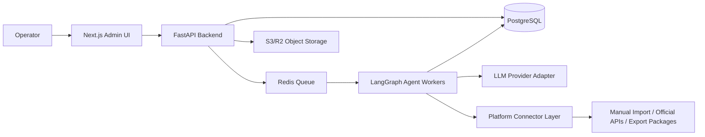
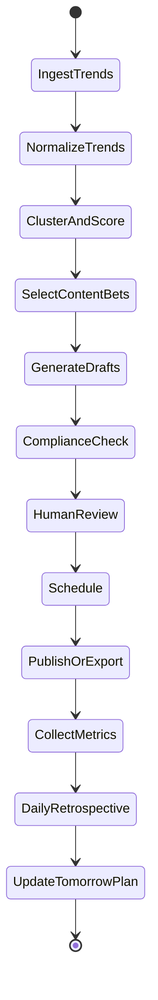

# Technical Design: AutoOps Content Agent

## Stack Decision

Recommended stack for an AI-capability-first automation backend:

- Frontend: Next.js, TypeScript, shadcn/ui, Tailwind CSS.
- API and agent service: Python FastAPI, Pydantic, LangGraph.
- Database: PostgreSQL, SQLAlchemy/Alembic.
- Queue and scheduled jobs: Redis plus Celery or RQ.
- Object storage: S3-compatible storage such as Cloudflare R2 for media, exports, and imports.
- AI provider layer: OpenAI-compatible adapter with model routing.
- Auth: start with single-workspace admin auth; move to workspace/team auth later.
- Observability: structured logs, Sentry, background job dashboard, and audit event table.
- Deployment: Docker Compose for local development; Render/Fly.io/Railway or similar for MVP; private deployment later if needed.

Why this stack:

- The user prioritizes AI capability, so Python and LangGraph are a strong fit for stateful agent workflows.
- Next.js provides a polished professional backend UI quickly.
- PostgreSQL is reliable for content, status history, metrics, and audit logs.
- Redis workers fit scheduled ingestion, generation, reporting, and connector jobs.
- Keeping connectors behind interfaces prevents the MVP from depending on uncertain platform API approvals.

Alternative:

- A pure TypeScript stack with Next.js API routes, Drizzle/Prisma, BullMQ, and LangChain.js is simpler operationally. Use it if one-service deployment matters more than agent depth.

## Architecture Overview



## Core Modules

```text
apps/
  web/
    app/
    components/
    features/
      command-center/
      trend-radar/
      draft-review/
      calendar/
      retrospectives/
    lib/api-client/

services/
  api/
    app/
      main.py
      models/
      schemas/
      routes/
      services/
      connectors/
      agents/
      jobs/
      prompts/
      observability/
    alembic/

fixtures/
  trends/
  metrics/
  brand_profiles/

docs/
```

## Data Model

### Workspace

- id
- name
- default_language
- created_at

### BrandProfile

- id
- workspace_id
- brand_name
- category
- audience
- offer
- differentiators
- tone
- keywords
- banned_terms
- forbidden_claims
- compliance_notes
- examples
- created_at
- updated_at

### TrendSource

- id
- workspace_id
- platform
- source_type: manual, url, csv, official_api, fixture
- source_url
- raw_payload
- imported_at

### TrendCandidate

- id
- workspace_id
- source_id
- platform
- title
- summary
- raw_text
- topic
- format
- tags
- freshness_score
- brand_fit_score
- channel_relevance_score
- risk_score
- status
- created_at

### TrendCluster

- id
- workspace_id
- title
- summary
- representative_trend_id
- trend_ids
- score
- reasoning
- created_at

### ContentDraft

- id
- workspace_id
- trend_cluster_id
- platform
- status: draft, needs_review, approved, scheduled, published, rejected, archived
- title
- hook
- body
- script
- outline
- hashtags
- media_brief
- ai_rationale
- risk_notes
- created_by_agent_run_id
- current_version_id
- scheduled_for
- created_at
- updated_at

### DraftVersion

- id
- draft_id
- source: ai, human
- content_json
- prompt_version
- model
- created_at

### PublicationRecord

- id
- draft_id
- platform
- external_id
- publish_mode: manual_export, official_api, mock
- published_at
- status
- error_message

### ContentMetric

- id
- publication_record_id
- date
- impressions
- views
- likes
- comments
- shares
- saves
- follows
- clicks
- conversions
- notes

### Retrospective

- id
- workspace_id
- date
- summary
- wins
- misses
- insights
- tomorrow_plan
- confidence
- created_by_agent_run_id

### AgentRun

- id
- workspace_id
- run_type: trend_score, draft_generation, retrospective, plan_update
- input_json
- output_json
- status
- model
- token_usage
- started_at
- completed_at
- error_message

### AuditEvent

- id
- workspace_id
- actor_type: user, agent, system
- actor_id
- entity_type
- entity_id
- action
- before_json
- after_json
- created_at

## API Contracts

Example routes:

- `POST /workspaces`
- `GET /brand-profile`
- `PUT /brand-profile`
- `POST /trend-sources/import`
- `GET /trends`
- `POST /trends/cluster`
- `POST /drafts/generate`
- `GET /drafts`
- `PATCH /drafts/{id}`
- `POST /drafts/{id}/regenerate`
- `POST /drafts/{id}/schedule`
- `GET /calendar`
- `POST /metrics/import`
- `POST /retrospectives/generate`
- `GET /retrospectives`
- `GET /agent-runs/{id}`

## Agent Workflow



LangGraph nodes:

- `normalize_trends`
- `cluster_trends`
- `score_brand_fit`
- `select_content_bets`
- `generate_platform_drafts`
- `check_brand_guardrails`
- `summarize_metrics`
- `diagnose_performance`
- `update_tomorrow_strategy`

Use checkpoints so failed or paused runs can resume.

## Connector Strategy

Each platform connector implements:

- `import_trends()`
- `import_metrics()`
- `export_draft_package()`
- `create_remote_draft()` if officially supported
- `schedule_or_publish()` if officially supported

Connector modes:

- `fixture`: demo data for development.
- `manual`: CSV, URL, paste, or export package.
- `official_api`: approved platform API.
- `mock`: simulate execution for local testing.

MVP connector priority:

1. Manual/fixture connector for all four platforms.
2. WeChat Official Account draft or metrics connector if account permissions are available.
3. Bilibili/Douyin/Xiaohongshu official APIs only after documentation and account scope verification.

Avoid unofficial scraping or credential-based browser automation for MVP.

## Signature Feature Implementation

### Trend-to-Brand Drafting

Inputs:

- BrandProfile
- TrendCluster
- Platform target
- Recent performance summary
- Content constraints and banned terms

Steps:

1. Summarize source trend.
2. Explain why it is or is not suitable for the brand.
3. Generate platform-native draft.
4. Run guardrail checks.
5. Store draft, version, rationale, and warnings.

Validation:

- Draft references the chosen trend.
- Draft follows platform format.
- Draft avoids banned terms and unsupported claims.
- Draft includes editable fields rather than one opaque text block.

### Daily Retrospective to Tomorrow Strategy

Inputs:

- Yesterday's scheduled/published content.
- Imported metrics.
- Draft metadata: trend, topic, hook, platform, time, format.
- Previous plan.

Steps:

1. Calculate simple performance deltas and rankings.
2. Identify high-performing topics, hooks, formats, and channels.
3. Detect weak or inconclusive signals.
4. Generate daily retrospective.
5. Update tomorrow's recommended topic mix and draft queue.

Validation:

- Changing metric inputs changes the recommendation.
- Report cites concrete posts and metrics.
- Low-sample findings are marked as low confidence.
- User can override and save the override reason.

## State Management

- Server owns workflow state in PostgreSQL.
- UI uses server data via API client and optimistic updates only for small interactions.
- Long-running jobs return an `agent_run_id`; UI polls or subscribes for status.
- Draft editor stores autosaved edits as new DraftVersion rows.

## Authentication and Authorization

MVP:

- Single workspace.
- One admin account or local dev auth gate.
- API token between web and agent service.

Later:

- Workspaces, roles, teams, client access, reviewer roles, and SSO.

## Error Handling

- Every background job writes status, retries, and error message.
- Connector errors should include platform, operation, account, and retryability.
- AI failures should preserve input and allow retry/regenerate.
- Risky generated content should become `needs_review`, not fail silently.

## Security and Privacy

- Do not store platform passwords.
- Prefer official OAuth/API tokens where available.
- Encrypt sensitive connector credentials.
- Keep unpublished content and brand profile private.
- Log AI prompts and outputs for audit, but allow future redaction of sensitive data.
- Do not bypass platform controls.

## Testing Strategy

- Unit tests for scoring, prompt assembly, guardrails, and metric calculations.
- API tests for draft lifecycle and retrospective generation.
- Worker tests using fixture trends and metrics.
- Playwright smoke test for the full daily loop.
- Snapshot tests for generated structured outputs with mocked LLM responses.

## Deployment and Environment Variables

Example environment variables:

- `DATABASE_URL`
- `REDIS_URL`
- `S3_ENDPOINT`
- `S3_BUCKET`
- `S3_ACCESS_KEY_ID`
- `S3_SECRET_ACCESS_KEY`
- `LLM_PROVIDER`
- `LLM_API_KEY`
- `LLM_BASE_URL`
- `WEB_APP_URL`
- `API_INTERNAL_TOKEN`
- `SENTRY_DSN`

## Observability and Operations

- Agent run table for traceability.
- Background job dashboard.
- Structured logs with workspace and agent run IDs.
- Sentry for frontend/backend exceptions.
- Daily summary of failed connector jobs.
- Token usage and cost tracking per workspace.

## Known Tradeoffs

- Python + Next.js is more powerful for AI but more complex than a single TypeScript app.
- Manual import/export lowers platform risk but makes the MVP less magical.
- Starting single-workspace accelerates development but delays agency/team features.
- Using LLMs for recommendations creates explainability and consistency requirements.
